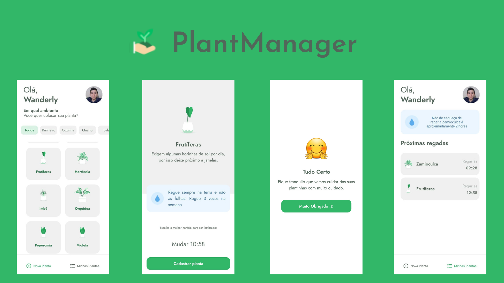

   <h1 style="text-align: center; vertical-align: center;">PlantManager </h1>
   
Aplicativo para dispositivos moveis Android | IOS feito em React Native durante o Evento NLW#5(Next Level Week 5° edição) trilha React Native

   
   <h3>🚀 Tecnologias Usadas</h3>
   <ul>
      <li>React Native</li>
      <li>Expo</li>
      <li>typeScript</li>
      <li>JSON-SERVER</li>
      <li>React Navigation</li>
   </ul>
   <h3>💻 Como usar no seu PC</h3>
   <ul>
      <li>Antes é preciso ter instalado o <a href="https://nodejs.org/en/">NodeJS</a> e o <a href="https://docs.expo.io/get-started/installation/">Expo Cli</a></li>
      <li>Dá um git clone neste repositorio</li>
      <li>Dá um cd na pasta que colocou este repositorio</li>
      <li>code . para abrir no VSCode</li>
      <li>No terminal no VSCode usar expo install</li>
      <li>Depois da Instalação roda expo start</li>
      <li>Depois disso acesse http://localhost:19002</li>
      <li>Assim você pode escolher se vai rodar no emulador ou no celular</li>
      <li>Se for no seu propio celular é preciso baixo na loja de aplicativos o Expo Go e depois escanear o QRCode</li>
      <li>Se for no emulador <a href="https://www.youtube.com/watch?v=eSjFDWYkdxM">neste link</a> tem um tutorial de como configurar o emulador</li>
   </ul>
   <h3>👍 Como ajudar</h3>
   <ul>
      <li>Faça um fork do projeto.</li>
      <li>Crie uma nova branch com as suas alterações: git checkout -b my-feature</li>
      <li>Salve as alterações e crie uma mensagem de commit contando o que você fez: git commit -m "feature: My new feature"</li>
      <li>Envie as suas alterações: git push origin my-feature</li>
   </ul>
   <a style="
      width: 40%;
      padding: 5%;
      background-color: #32B768;
      color: #fff;
      text-align: center;
   " href="https://drive.google.com/file/d/17_FvERMIj2LToRfzFV__T9UET7rR8ZIt/view?usp=sharing">Baixar PlantManager ⬇️</a>

